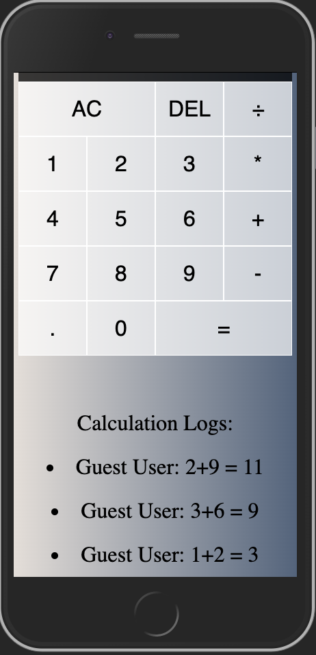

# The Collaborative Calculator

This is Harrison Nguyen's solution to sezzle's coding challenge.

Duration: 2-5 hours

This project was built within a few hours time - culminating with a community calculator built in vanilla JavaScript and styled primarily with CSS. The calculatoris structured as an object with global variables and a few event listeners. You can find my code within the client and server folder. I started by flowcharting the base features that were required within the project and utilized online resources like w3schools, developer.mozilla, and stack overflow to find built-in functions, methods, and libraries (like socket.io). Feel free to contact me if you have any questions about my code.  

## Scrennshots

### Computing calculations

### Calculator logs

## Usage 
- Using socket.io, this calculator logs calculations as they happen and shares those calculations with everyone connected to the website.
- Calculation results are logged below the calculator and remain between sessions, showing only the last 10 calculations descending from most recent to oldest.

## Built With
- JavaScript
- Socket.io
- Express
- Node
- HTML
- CSS

## Resources
A really great repository that helped teach me socket.io: https://github.com/bradtraversy/chatcord